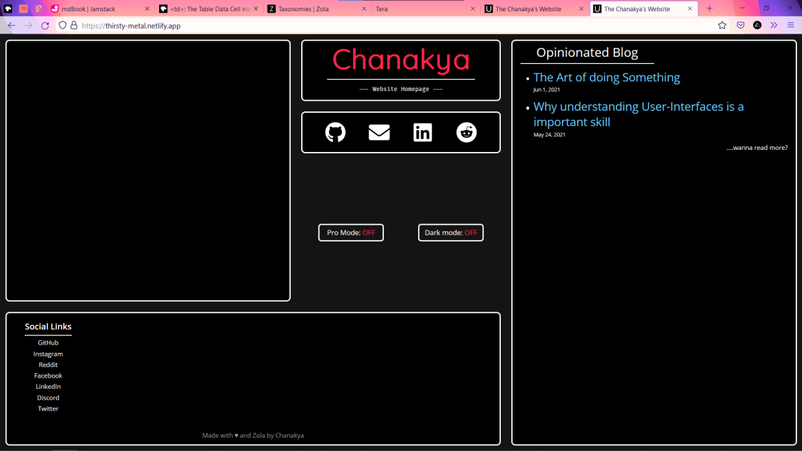

## The Beginning

Well, It was a lazy start. I had been planning on redesigning the layout for few months before I actually [started](https://github.com/U-C-S/u-c-s.github.io/commit/3df7524aabdce0d97ae426079af9d3e8cba8fa3a) working on it in April 2021. I began with designing the layout using pure HTML, CSS. Intial layout ideas looked good, so, I started putting more effort on styling of it, while ignoring any addition of content. Meanwhile, Web-Components caught my eye. They looked interesting alternative to React.js. So, I planned on including them for the site.

Then, I discovered about [Static Site Generators](https://jamstack.org/generators/) from JAMStack.org website which is quite a surprise to me because I was purely mistaken what they actually meant previously. I was also using Gatsby.js for other websites, which I found is also one of it. Checking out how others build their static websites made me realise they are really something more than what I expected. So, I decided on finding myself a Static Site Generator to build my website.

## Zola

As a fan of [Rust Language](https://www.rust-lang.org/) already, I was finding reasons to learn and use it. From the list available in JAMstack, I found about a couple made with Rust. [Zola](https://jamstack.org/generators/zola/) is one of them, and it got my attention for number of Features it has. Few days later, I accidentaly started trying it. The process of intalling it in my Windows 10 machine also helped me to learn a couple of new things like setting Enviroment Variables.

I Struggled a bit on understanding all the new stuff like Template Engines and its Content Generation using Markdown. So, I just skipped learning it and just ported a existing page I already did to use Zola. It [worked](https://github.com/U-C-S/u-c-s.github.io/commit/ea6d1ad4222da3c66def308cc90f92b5b12129e6) somehow and I liked how fast it was for development server. Then I added [TypeScript](https://www.typescriptlang.org/) build process using [Concurrently](https://github.com/kimmobrunfeldt/concurrently) because I love TypeScript. There are some bugs in the current build(v0.13) of Zola. So, I had to compile the source code myself to use Zola Next version for the patch.

Suddenly, Designing became snail-pace for the rest of the month May. May be I was little stressed about some stuff then or Didn't like the thought of having my own blog and website, Which I dont remember now. It picked the pace again in intial june days after I figured out how to add Blog Section using Zola. By then, This is how it looks.....

## An Another Redesign

I also started learning Rust from [The Book](https://doc.rust-lang.org/book/) while working on the website as a Fun Project. A realisation striked me that I don't have enough content to fill all blocks. I felt the need to replace some of the content space with emptiness, while also maintaining similar look. So, I started imagining new layouts and Started implementing one I felt would look good in a seperate git branch. This is where the project started picking up the pace again.

The 2 empty content blocks are merged into one, and the tab navigation is implemented using TypeScript to navigate to other content. The Social Media links previously at the center where made to vertical list and moved to right side for the mobile versions for easy access. After a little polish in the next 3days, This is how it looks like...

The emptiness in the center was still the question then. Ignoring it, I started concentrating on designing of Blog and Article page though I didn't like process of creating them. So, I worked with a lazy thinking.

Soon, Came the need for URL parameters due to inner tab navigation.
